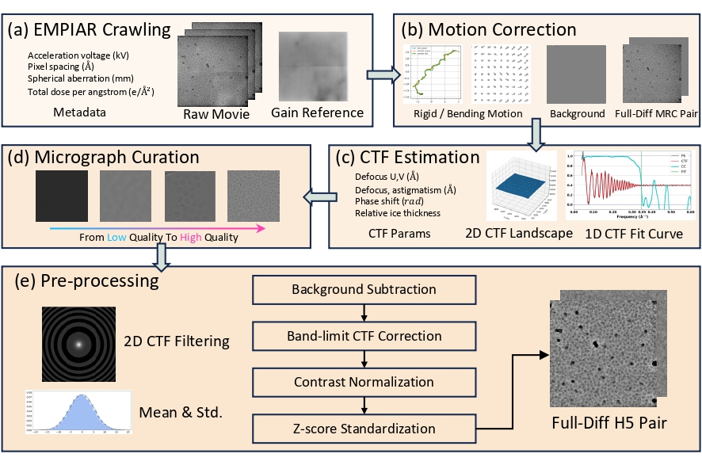

# CryoCRAB-Scripts
**CryoCRAB: A Large-scale Curated and Filterable Dataset for Cryo-EM Foundation Model Pre-training**

## Description
The CryoCRAB dataset comprises 152,385 sets of raw movie frames, covering 746 datasets from EMPIAR. Each EMPIAR dataset typically includes approximately 200 cryo-EM images, consisting of raw movies, motion-corrected full-diff micrographs in MRC format along with estimated background images, and preprocessed full-diff micrographs in HDF5 format. The entire dataset, including micrographs and metadata, totals approximately 12.18 TB.

## Download
The complete dataset is available for download from the ScienceDB public repository: [doi.org/10.57760/sciencedb.17922](https://doi.org/10.57760/sciencedb.17922).

## TODO
- Method List
  - [x] EMPIAR Crawling & Curation Notebook
  - [x] MongoDB Dataset Generation Notebook
  - [x] EMPIAR Download Example Notebook
  - [x] CryoSPARC Automated Processing Notebook
  - [x] CryoCRAB Preprocessing Example Notebook
  - [x] CryoCRAB Full-Diff HDF5 Pair Generation Notebook
- Visualization List
  - [ ] Motion Correction & Visualization Notebook
  - [ ] CTF Correction & Visualization Notebook
 

 
